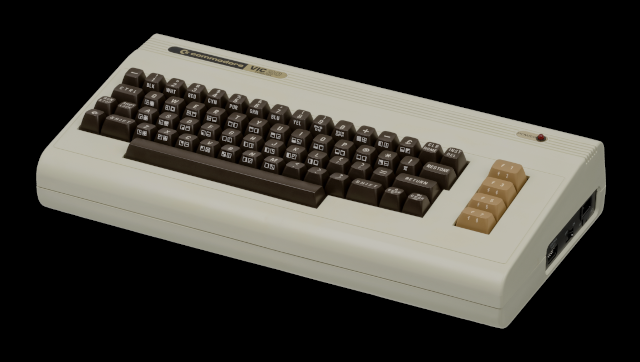
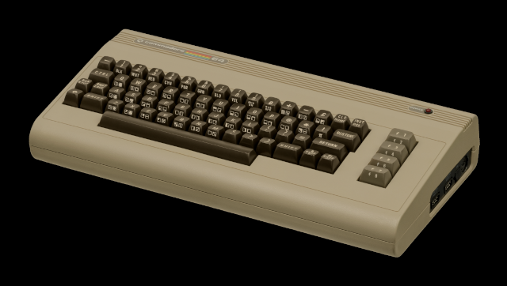
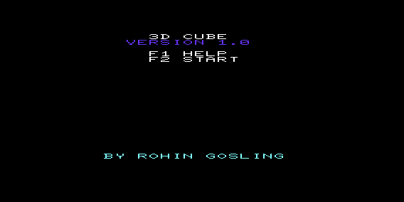
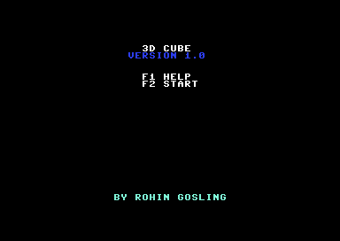

# 3D Cube Demo (VIC-20 and C64)


<p align="center">
  <b>Commodore VIC-20</b>&emsp;&emsp;&emsp;&emsp;&emsp;&emsp;&emsp;&emsp;&emsp;&emsp;&emsp;&emsp;&emsp;&emsp;&emsp;&emsp;&emsp;&emsp;&emsp;&emsp;&emsp;<b>Commodore 64</b>
</p>
<p align="center">
  &emsp;
  
</p>
<p align="center">
  &emsp;
  
</p>

A real-time interactive wire-frame 3D cube renderer for the unexpanded **Commodore VIC-20** and the **Commodore 64**. Both versions were originally written in the late 1980s and early 1990s, hand-assembled and poked into RAM with my own [**Code Probe**](https://github.com/rohingosling/code-probe-vic-20) machine-language monitor. In 2026 the saved PRG files were disassembled and re-expressed as modern [**Kick Assembler**](http://www.theweb.dk/KickAssembler/) source listings, which are now much easier to modify and maintain.

## 📑 Contents

- [🔎 Overview](#-overview)
- [🚀 Quick Start](#-quick-start)
- [🕒 History](#-history)
- [🎮 Controls](#-controls)
- [💾 Loading and Starting](#-loading-and-starting)
- [💿 Disk and Tape Image Listings](#-disk-and-tape-image-listings)
- [💻 Building From Source](#-building-from-source)
- [📐 Pipeline Math](#-math)
- [🙋‍♂️ Acknowledgements](#-acknowledgements)
- [📄 License](#-license)

## 🔎 Overview

**3D Cube** is a 6502 machine language graphics demo that renders a rotating wire-frame cube in real time on a stock **Commodore VIC-20** or **Commodore 64**. Eight vertices are transformed through a five-stage fixed-point pipeline that includes, yaw rotation, pitch rotation, world-space translation, perspective projection with aspect correction and zoom, and screen-space mapping. The twelve resulting edges are rasterised with a Bresenham line renderer onto a pseudo-pixel canvas synthesised from PETSCII quadrant-block characters.

Both the **VIC-20** and **C64** versions share the same 3D pipeline, fixed-point math, sine and inverse-depth tables, Bresenham line drawer, and keyboard control. They differ in screen geometry, aspect correction, load address, and the **BASIC**-stub addresses enable running from **BASIC**.

### Features

- **Wire-frame 3D rendering** <br>Eight-vertex, twelve-edge unit cube. Yaw + pitch rotation, world-space three-axis translation, perspective projection with per-vertex pre-computed `1/depth` lookup, and post-projection zoom.

- **Pseudo-pixel grid** <br>Synthesises a low-resolution pseudo-pixel canvas from the standard character matrix using quadrant-block PETSCII graphics. The eight quadrant-block PETSCII characters and their reverse-video forms cover all sixteen possible 2 x 2 quadrant masks per character cell. This gives an effective pseudo-pixel resolution of 44 x 46 on the **VIC-20's** 22 x 23 character grid, and 80 x 50 on the **C64's** 40 x 25 character grid.

- **Double-buffered output** <br>Every frame is composed in a 506-byte (**VIC-20**) or 1000-byte (**C64**) back buffer and copied to screen RAM during vertical retrace, so the visible image is never partially drawn.

- **Auto-rotate or keyboard-control** <br>SPACE toggles between continuous auto-rotation (default) and interactive keyboard-control mode. Both modes share state, so the cube continues from wherever it was when SPACE was pressed.

- **Four-state UI** <br>Home, Help, and Main (animation). F1, F2, and F3 navigate between states.

- **Tunable aspect correction** <br>Per-axis Q1.7 aspect factors compensate for the machine's pixel-aspect ratio. Single-line `.const` edits at the top of the source file change the cube's rendered proportions without modifying the projection code.

- **Fixed-point math** <br>Signed 8-bit by 8-bit multiply (`multiply_signed_8`), assembly-time-generated sine and inverse-depth tables, and per-row screen-address tables that replace runtime multiplies.

### Targets

| Machine             | Source               | Load address | Run        | Pseudo-pixel resolution |
|---------------------|----------------------|--------------|------------|-------------------------|
| **Commodore VIC-20**| `src/cube-vic20.asm` | `$1001`      | `SYS 4110` | 44 x 46                 |
| **Commodore 64**    | `src/cube-c64.asm`   | `$0801`      | `SYS 2062` | 80 x 50                 |

## 🚀 Quick Start

Pick your target (VIC-20 or C64). Both downloads are pulled from the `v1.0.0` release.

### Run the VIC-20 version

| File                | Download                                                                                       | Use case                                                                |
|---------------------|------------------------------------------------------------------------------------------------|-------------------------------------------------------------------------|
| `cube-vic20.prg`    | [download](https://github.com/rohingosling/3d-cube-commodore/releases/download/v1.0.0/cube-vic20.prg) | Run on **VICE**, or load on a real **VIC-20** via **SD2IEC** / 1541 |
| `3d-cube.tap`       | [download](https://github.com/rohingosling/3d-cube-commodore/releases/download/v1.0.0/3d-cube.tap)    | Attach and load in **VICE**, or load on a real **VIC-20** via **TAPuino**, or record onto a cassette |
| `3d-cube.d64`       | [download](https://github.com/rohingosling/3d-cube-commodore/releases/download/v1.0.0/3d-cube.d64)    | Attach and load in **VICE**. Disk image contains both the **VIC-20** and **C64** builds            |

**Run on VICE:**

```bash
xvic -autostart cube-vic20.prg
```

The **VIC-20** version of the cube demo targets the unexpanded **VIC-20**. So no `-memory` or `-cartA` flag is needed.

**Run on real hardware** (PRG on **SD2IEC** / 1541, or tape on **TAPuino** / Datasette):

```
LOAD "CUBE-VIC20",8,1     (disk)
LOAD "CUBE-VIC20",1,1     (tape)
RUN
```

### Run the C64 version

| File                | Download                                                                                       | Use case                                                                |
|---------------------|------------------------------------------------------------------------------------------------|-------------------------------------------------------------------------|
| `cube-c64.prg`      | [download](https://github.com/rohingosling/3d-cube-commodore/releases/download/v1.0.0/cube-c64.prg)   | Run on **VICE**, or load on a real **C64** via **SD2IEC** / 1541        |
| `3d-cube.d64`       | [download](https://github.com/rohingosling/3d-cube-commodore/releases/download/v1.0.0/3d-cube.d64)    | Disk image containing both the **VIC-20** and **C64** builds            |

**Run on VICE:**

```bash
x64sc -autostart cube-c64.prg
```

**Run on real hardware** (PRG on **SD2IEC** / **Pi1541** / 1541):

```
LOAD "CUBE-C64",8,1
RUN
```

## 🕒 History

The original **VIC-20** version of the 3D cube demo was hand assembled and written using the [**Code Probe**](https://github.com/rohingosling/code-probe-vic-20) machine language monitor.

In 1990 I ported the 3D cube demo to **Commodore 64**, migrating the binary from tape to disk. Over the years the binaries made their way from, tape (1989) → disk (1990) → SD card via **SD2IEC** in the early 2000s → PC hard drive, where they remained dormant for many decades. ...Until now! 🎉

In 2026, I fished out the saved PRG binaries and used [**Claude Code**](https://www.anthropic.com/claude-code) to disassemble them and generate modern [**Kick Assembler**](http://www.theweb.dk/KickAssembler/) source listings for both the **VIC-20** and **C64** versions of the 3D cube demo. The reconstructed sources rebuild the original PRG files kind-of byte-for-byte-ish, but with a few bug fixes and lookup tables in moved to more optimal locations than the original 1989 and 1990 versions. Havging an assembly listing makes it much easier to modify and debug now.

For the sake of nostalgia I kept the title-screen layout, control scheme, and visual style of the original demo. But the new assembly source listings offer access to modern tooling.

## 🎮 Controls

The function keys F1, F2, and F3 are active on every screen including the main animation loop. The motion keys are active only in the main animation loop, with `control_mode = 1` (keyboard-control mode); SPACE toggles `control_mode`.

| Key       | Effect                                                                       |
|-----------|------------------------------------------------------------------------------|
| `F1`      | Toggle help — Home <-> Help, or pause animation with help overlay in Main.   |
| `F2`      | Start the animation from the Home screen.                                    |
| `F3`      | Return to the Home screen from any other state.                              |
| `SPACE`   | Toggle auto-rotate / keyboard-control mode (Main only).                      |
| `+` / `-` | Zoom in / out.                                                               |
| `W` / `R` | Yaw left / right.                                                            |
| `E` / `D` | Pitch up / down.                                                             |
| `S` / `F` | Translate X left / right.                                                    |
| `T` / `G` | Translate Y up / down.                                                       |
| `Q` / `A` | Translate Z closer / further.                                                |

In auto-rotate mode the motion keys are inactive. Only SPACE and the function keys work during auto-rotation mode. In keyboard-control mode the auto-rotation increments are suspended and motion keys take effect on every keypress.

## 💾 Loading and Starting

### LOAD commands

| Media | Commodore VIC-20                                  | Commodore 64                                    |
|-------|---------------------------------------------------|-------------------------------------------------|
| Tape  | `LOAD "CUBE-VIC20",1,1` <br>`RUN` or `SYS 4110`   | N/A                                             |
| Disk  | `LOAD "CUBE-VIC20",8,1` <br>`RUN` or `SYS 4110`   | `LOAD "CUBE-C64",8,1` <br>`RUN` or `SYS 2062`   |

The Commodore `LOAD` command takes three positional parameters — `LOAD "filename", device, secondary` — and each one matters here:

| Parameter   | Meaning                                                                                                                                                                                                                                                                                                                                          |
|-------------|--------------------------------------------------------------------------------------------------------------------------------------------------------------------------------------------------------------------------------------------------------------------------------------------------------------------------------------------------|
| `filename`  | Program name on tape or disk.                                                                                                                                                                                                                                                                                                                    |
| `device`    | The peripheral's **primary address** on the IEC serial bus. <br>`1` selects the Datasette (tape). <br>`8` selects the first disk drive (additional drives, if present, are `9`, `10`, `11`).                                                                                                                                                     |
| `secondary` | The **secondary address** — a sub-command sent to the device that selects how the load is performed. <br>`0` ignores the PRG file header's load address and relocates the program to the start of **BASIC's** program area. <br>`1` honours the load address stored in the PRG file header and places the program at exactly that address in memory. |

The cube demo's PRG file is laid out with a tokenised **BASIC** stub at the begining, followed by the machine-language body. The PRG file header's load address is set to the machine's **standard BASIC start** — `$1001` on the **VIC-20** and `$0801` on the **C64**.

After the load completes, `RUN` invokes the **BASIC** stub, which auto-`SYS`es to the machine-language entry at `$100E` (`SYS 4110`) on the **VIC-20** or `$080E` (`SYS 2062`) on the **C64**. The explicit `SYS` form jumps to the entry directly without going through **BASIC**.

> **Note:** <br>Although the programs are loaded at `$1001` for the **VIC-20** and `$0801` for the **C64**, the `SYS` command needs to target the first machine-language instruction *after* the **BASIC** stub, at location `$100E` for the **VIC-20** and `$080E` for the **C64**.

### From the VICE emulator

To launch `xvic` with `build/cube-vic20.prg` autostarted:

```bash
xvic -autostart build/cube-vic20.prg
```

To launch `x64sc` with `build/cube-c64.prg` autostarted:

```bash
x64sc -autostart build/cube-c64.prg
```

The **VICE** binary must be on `PATH`, or substitute the full path to your **VICE** install (e.g. `C:\Programs\GTK3VICE-3.10-win64\bin\xvic.exe` / `x64sc.exe` on Windows, `/usr/bin/xvic` / `/usr/bin/x64sc` on most Linux distributions).

The supplied `run-cube-vic20.bat` and `run-cube-c64.bat` (Windows) wrap the same launches with sensible default install paths.

### What happens at startup

1. The screen border and background are set to black via the machine's VIC chip registers.
2. The KERNAL text colour is set to white.
3. The screen is cleared via `CHROUT $93`.
4. The screen-code-to-mask reverse-lookup table is initialised.
5. The 3D state is initialised: `yaw_angle = 0`, `pitch_angle = 0`, `control_mode = 0` (auto-rotate), translations zeroed, `zoom_factor = $40` (unity).
6. The Home screen is rendered.
7. The main loop begins in `STATE_HOME`, awaiting F1 (help) or F2 (start).

```
        3D CUBE
      VERSION 1.0

        F1 HELP
        F2 START


    BY ROHIN GOSLING
```

## 💿 Disk and Tape Image Listings

**3D Cube** is released on two media images: a tape image carrying the **VIC-20** version, and a disk image carrying both the **VIC-20** and **C64** versions.

### Tape — `dist/3d-cube.tap`

| File         | Machine             | Description                          |
|--------------|---------------------|--------------------------------------|
| `CUBE-VIC20` | **Commodore VIC-20**| **VIC-20** version of **3D Cube**.   |

### Disk — `dist/3d-cube.d64`

| File         | Machine             | Description                                                                                |
|--------------|---------------------|--------------------------------------------------------------------------------------------|
| `CUBE-VIC20`&nbsp; | **Commodore VIC-20**| **VIC-20** version of **3D Cube**.                                                         |
| `CUBE-C64`   | **Commodore 64**    | **C64** version of **3D Cube**.                                                            |
| `CLS`        | **Commodore 64**    | Utility program. Clears the screen and sets colours to green text on black background.     |

## 💻 Building From Source

**3D Cube** is a pair of single-file assembly projects built with [**Kick Assembler**](http://www.theweb.dk/KickAssembler/). Java is required.

**Assemble the VIC-20 build:**

```bash
java -jar KickAss.jar src/cube-vic20.asm -odir build
```

**Assemble the C64 build:**

```bash
java -jar KickAss.jar src/cube-c64.asm -odir build
```

Or, on Windows, run the supplied drivers:

```
build-cube-vic20.bat
build-cube-c64.bat
```

The builds produce `build/cube-vic20.prg` (loads at `$1001`) and `build/cube-c64.prg` (loads at `$0801`). Each PRG runs on the corresponding physical Commodore machine and on its **VICE** emulator (`xvic` or `x64sc`).

### Running on physical hardware

Hardware required:

- A **Commodore VIC-20** (unexpanded, PAL or NTSC) for the **VIC-20** build, or a **Commodore 64** (PAL or NTSC) for the **C64** build.
- A means of transferring the assembled PRG from the build machine to the target machine — for example a 1541 / 1541-II disk drive with a PRG-to-D64 toolchain, an SD-card drive emulator (**SD2IEC**, **Pi1541**, Ultimate II), or a serial cable to a real disk drive.

With the PRG on disk, load with `LOAD "filename",<device>,1` and start with `RUN`, as shown in [Loading and Starting](#-loading-and-starting).

### Running in VICE

```bash
xvic -autostart build/cube-vic20.prg
x64sc -autostart build/cube-c64.prg
```

Run from the project root so the relative path to `build/` resolves. The corresponding **VICE** binary must be on `PATH`, or substitute the full path to your **VICE** install.

## 📐 Math

The 3D Cube demo renders an eight-vertex, twelve-edge wire-frame cube in real time on a 1 MHz **6502** / **6510** (6502 for the **VIC-20** and 6510 for the **C64**). Every frame projects all eight vertices through the same five-stage pipeline; yaw rotation, pitch rotation, world-space translation, perspective projection with aspect correction and zoom, and screen-space mapping. Then rasterises the twelve edges with a Bresenham line renderer. The **6502**/**10** has no hardware multiplier, no divider, and no floating-point unit, so every numerical step is implemented in fixed-point arithmetic with assembly-time-generated lookup tables for the transcendentals.

### Notation

Throughout this section:

- $\theta$ denotes the yaw angle, $\varphi$ denotes the pitch angle.
- Angles are encoded as 8-bit unsigned integers $`a \in \{0, 1, \ldots, 255\}`$ with one full revolution = 256 steps, so $\theta_{\text{rad}} = 2\pi a / 256$.
- $\mathbf{v} = (x, y, z)^{T}$ denotes a vertex in object space; $\mathbf{v}'$ denotes the same vertex after the current pipeline stage.
- $Qm.n$ denotes a fixed-point format with $m$ integer bits and $n$ fraction bits; for example $Q2.6$ stores values in $[-2.0, +2.0)$ at a resolution of $2^{-6} = 1/64$.
- $\gg$ denotes an arithmetic right shift; $\ll$ denotes a left shift.
- $\lfloor \cdot \rfloor$ denotes integer floor; $\bmod$ denotes truncated integer modulus.

### 1. Fixed-point number formats

The pipeline uses three Q-formats. All are packed into a single 8-bit byte; the multiplier produces a 16-bit intermediate that is shifted back to 8-bit before storage.

| Format | Sign     | Range                       | Resolution | Used for                                                |
|--------|----------|-----------------------------|------------|---------------------------------------------------------|
| Q2.6   | signed   | $[-2.0, +2.0)$              | $1/64$     | vertex coordinates, translation offsets, rotation state |
| Q1.6   | signed   | $[-1.0, +1.0)$              | $1/64$     | sine table, zoom factor                                 |
| Q1.7   | unsigned | $[0.0, +2.0)$               | $1/128$    | aspect factors, inverse-depth scale                     |

The numerical interpretation of an 8-bit byte $b$ in each format is:

```math
v_{Q2.6}(b) = \frac{b}{64}, \quad v_{Q1.6}(b) = \frac{b}{64}, \quad v_{Q1.7}(b) = \frac{b}{128}
```

- The signed formats use two's-complement decoding.
- Cube vertices are stored as $\pm 40$ in $Q2.6$, equal to $\pm 0.625$ in real units.
- A combined yaw + pitch rotation can stretch this magnitude to the body-diagonal maximum $40\sqrt{3} \approx 69$, which still fits comfortably in signed 8-bit ($\pm 128$).

The product of two Q-formats has fraction bits equal to the sum of the operand fraction bits. The two product types in the pipeline are:

```math
\underbrace{x}_{Q2.6} \cdot \underbrace{s}_{Q1.7} \;\to\; \underbrace{p}_{Q3.13}, \qquad \underbrace{x}_{Q2.6} \cdot \underbrace{c}_{Q1.6} \;\to\; \underbrace{p}_{Q3.12}
```

To return to $Q2.6$, the 16-bit product is shifted right — by 7 bits in the first case, by 6 in the second. On the 6502 a sign-preserving $\gg n$ on a 16-bit value is implemented as $(16 - n)$ left shifts of the 16-bit accumulator (`asl multiply_result_lo / rol multiply_result_hi`) followed by reading the high byte: an arithmetic right shift through the carry flag. So $\gg 7$ is one ASL / ROL pair, then read the high byte; $\gg 6$ is two ASL / ROL pairs, then read the high byte.

In assembly, the two reshifts look like this:

```kickass
// Q3.13 -> Q2.6:  >> 7  (used after a Q2.6 * Q1.7 product, e.g. perspective).

asl multiply_result_lo
rol multiply_result_hi
lda multiply_result_hi                      // A = signed Q2.6 result

// Q3.12 -> Q2.6:  >> 6  (used after a Q2.6 * Q1.6 product, e.g. rotation / zoom).

asl multiply_result_lo
rol multiply_result_hi
asl multiply_result_lo
rol multiply_result_hi
lda multiply_result_hi                      // A = signed Q2.6 result
```

### 2. Signed 8-bit multiply

The 6502 has no hardware multiplier. The cube relies on `multiply_signed_8`, which computes a signed 16-bit product $p = a \cdot b$ of two signed 8-bit operands via the shift-and-add identity:

```math
a \cdot b = \mathrm{sgn}(a) \cdot \mathrm{sgn}(b) \cdot \sum_{i=0}^{7} |a| \cdot \big( \beta_i(b) \cdot 2^{i} \big)
```

where $\beta_i(b)$ is bit $i$ of $|b|$. The implementation is straight-line:

1. Record $\mathrm{sgn}(p) = \mathrm{sgn}(a) \oplus \mathrm{sgn}(b)$ as the XOR of bit 7 of each operand.
2. Replace $a$ and $b$ with their absolute values via `EOR #$FF / CLC / ADC #$01` (two's-complement negation).
3. Iterate eight times: shift the multiplier right one bit (consume bit 0 into the carry flag), conditionally add the multiplicand to the result high byte on carry, then rotate the 16-bit accumulator right by one. After eight iterations the eight partial products have been summed and the accumulator holds $|a| \cdot |b|$.
4. If the recorded sign is negative, two's-complement-negate the 16-bit accumulator.

The **C64** version adds a second variant, `multiply_signed_unsigned_8`, used by the aspect-correction stage. The multiplier is consumed as an unsigned $0..255$ magnitude; only the multiplicand contributes the result's sign:

```math
p = \mathrm{sgn}(a) \cdot |a| \cdot b, \qquad b \in \{0, 1, \ldots, 255\}
```

The **C64** needs this variant because the default $`\texttt{ASPECT\_FACTOR\_X} = 128`$ would, if treated as signed, decode to $-128$ and flip the cube horizontally on every frame. The **VIC-20** escapes the issue because its single $`\texttt{ASPECT\_FACTOR}`$ is $\lfloor 128 \cdot 2/3 \rfloor = 85$, safely below $128$, and so it can use the standard signed multiply throughout.

The eight-iteration shift-and-add core, after sign-stripping the operands and recording `multiply_sign = a ^ b`:

```kickass
ldx #$08

multiply_signed_8_loop:

    lsr multiply_b                              // Next bit of |b| -> carry.
    bcc multiply_signed_8_no_add

    clc
    lda multiply_result_hi
    adc multiply_a                              // High byte += |a|.
    sta multiply_result_hi

multiply_signed_8_no_add:

    ror multiply_result_hi                      // Shift the 16-bit accumulator right by 1.
    ror multiply_result_lo
    dex
    bne multiply_signed_8_loop
```

After the loop, if `multiply_sign` has bit 7 set, two's-complement-negate the 16-bit product. The `multiply_signed_unsigned_8` variant omits the sign-strip on `multiply_b`, so a literal $128$ stays positive.

### 3. Trigonometry — sine and cosine

**3D Cube** uses a 256-entry sine table for trigonometry, indexed by an 8-bit unsigned angle. The sine table used in the original 1989 version of **3D Cube** was generated with a **BASIC** program, and the values poked into RAM where they could be saved to tape with the rest of the demo's machine-language code and data while it was being developed. For the **Kick Assembler** reconstruction, we use **Kick Assembler's** script language to generate the sine table at assembly time:

```kickass
sin_table:
    .fill 256, round( 64 * sin( i * 2 * PI / 256 ) )
```

Equivalently:

```math
\texttt{sin\_table}[a] = \mathrm{round}\!\left( 64 \sin\!\left( \frac{2\pi a}{256} \right) \right), \qquad a \in \{0, 1, \ldots, 255\}
```

The factor of $64$ scales $\sin(\cdot) \in [-1, +1]$ into the $Q1.6$ range $[-64, +64]$.

A separate cosine table is unnecessary because of the standard identity:

```math
\cos(\theta) = \sin\!\left( \theta + \tfrac{\pi}{2} \right)
```

In the 256-step encoding, $\pi/2$ corresponds to $64$ (i.e. `$40` hex). So:

```math
\cos(a) \equiv \texttt{sin\_table}\big[(a + 64) \bmod 256\big]
```

The modulo-256 reduction is free on a 6502 because adding two 8-bit bytes naturally wraps mod 256. The yaw and pitch rotation routines perform this with `clc / adc #$40` on the angle byte, then re-index the sine table for the cosine value.

```kickass
ldy yaw_angle
lda sin_table, y                            // A = sin(theta).
sta rotate_sin

tya                                         // A = yaw_angle.
clc
adc #$40                                    // A = yaw_angle + 64  (cos = sin(a + 90)).
tay
lda sin_table, y                            // A = cos(theta).
sta rotate_cos
```

The corresponding **Kick Assembler** table definitions are one line each:

```kickass
sin_table:
    .fill 256, round( 64 * sin( i * 2 * PI / 256 ) )
```

### 4. Rotation

Yaw rotation (around the Y axis):

```math
R_{y}(\theta) = \begin{pmatrix} \cos\theta & 0 & -\sin\theta \\ 0 & 1 & 0 \\ \sin\theta & 0 & \cos\theta \end{pmatrix}
```

Pitch rotation (around the X axis):

```math
R_{x}(\varphi) = \begin{pmatrix} 1 & 0 & 0 \\ 0 & \cos\varphi & -\sin\varphi \\ 0 & \sin\varphi & \cos\varphi \end{pmatrix}
```

The composed rotation applied per frame is yaw-then-pitch:

```math
\mathbf{v}' = R_{x}(\varphi) \, R_{y}(\theta) \, \mathbf{v}
```

In assembly, neither matrix is materialised. The pipeline applies $R_{y}$ first, computing for each of the eight vertices:

```math
\begin{aligned}
x' &= x \cos\theta - z \sin\theta \\
y' &= y \\
z' &= x \sin\theta + z \cos\theta
\end{aligned}
```

with results written into `rotated_vertices`. It then applies $R_{x}$ in place:

```math
\begin{aligned}
x'' &= x' \\
y'' &= y' \cos\varphi - z' \sin\varphi \\
z'' &= y' \sin\varphi + z' \cos\varphi
\end{aligned}
```

Each of the four multiplies per axis is a `multiply_signed_8` call on $Q2.6 \cdot Q1.6$ operands; the 16-bit product is shifted left by 2 bits (two ASL / ROL pairs) and the high byte is taken as the new $Q2.6$ coordinate.

A subtle gotcha in the pitch stage: because $y''$ depends on $z'$ and $z''$ depends on $y'$, the routine must cache $y'$ and $z'$ in `pitch_y` / `pitch_z` before any write to `rotated_vertices`, otherwise the second pair of multiplies would read the already-overwritten $y'$. The yaw stage has no such constraint because it reads from `cube_vertices` (a separate buffer) and writes into `rotated_vertices`.

When the yaw and pitch angle increments differ, the cube traces a Lissajous figure on the unit sphere whose period equals the LCM of the two angle increments. This is the source of the continuous tumbling motion in auto-rotate mode.

The yaw stage's X output, $x' = x \cos\theta - z \sin\theta$, expands to two `multiply_signed_8` calls with a `>> 6` reshift between each multiply and the subtract:

```kickass
// x * cos(theta).

lda cube_vertices + 0, y                    // x
sta multiply_a
lda rotate_cos
sta multiply_b
jsr multiply_signed_8
asl multiply_result_lo                      // Q3.12 -> Q2.6.
rol multiply_result_hi
asl multiply_result_lo
rol multiply_result_hi
lda multiply_result_hi
sta rotate_temp                             // Cache x * cos.

// z * sin(theta).

lda cube_vertices + 2, y                    // z
sta multiply_a
lda rotate_sin
sta multiply_b
jsr multiply_signed_8
asl multiply_result_lo
rol multiply_result_hi
asl multiply_result_lo
rol multiply_result_hi

// x' = x*cos - z*sin.

sec
lda rotate_temp
sbc multiply_result_hi
sta rotated_vertices + 0, y
```

The other five rotated coordinates follow the same recipe with different operand pairs. The pitch stage caches $y'$ and $z'$ into `pitch_y` / `pitch_z` *before* the multiplies, so the second pair reads the pre-update values rather than the values the first pair just wrote back.

### 5. Translation

A simple component-wise add of the world-space offset $\mathbf{t} = (t_x, t_y, t_z)^{T}$:

```math
\mathbf{v}' = \mathbf{v} + \mathbf{t}
```

All three offsets are $Q2.6$ signed bytes and the implementation is a byte-wise `clc / adc` loop with no multiplies.

```kickass
ldy #$00

translate_vertices_loop:

    lda rotated_vertices + 0, y
    clc
    adc translate_x
    sta rotated_vertices + 0, y

    lda rotated_vertices + 1, y
    clc
    adc translate_y
    sta rotated_vertices + 1, y

    lda rotated_vertices + 2, y
    clc
    adc translate_z
    sta rotated_vertices + 2, y

    iny
    iny
    iny
    cpy #$18                                    // 8 vertices * 3 bytes = 24
    bne translate_vertices_loop
```

### 6. Perspective projection

The cube uses a classical pinhole projection with a fixed viewer placed on the $+Z$ axis. For a vertex at $(x, y, z)$ in eye space:

```math
d = D - z, \qquad x_{\text{proj}} = \frac{f \, x}{d}, \qquad y_{\text{proj}} = \frac{f \, y}{d}
```

where $D$ is the viewer distance and $f$ is the focal length. The constants are:

| Constant                  | Commodore VIC-20 | Commodore 64 |
|---------------------------|------------------|--------------|
| $D$ (`VIEWER_DISTANCE`)   | $150$            | $130$        |
| $f$ (`PROJECTION_FOCAL`)  | $40$             | $40$         |

With cube corners at $\pm 40$ in $Q2.6$, the rotated $z$ stays in $[-69, +69]$, so $d = D - z$ stays positive and within unsigned 8-bit on both targets. This keeps `inv_depth_focal[d]` directly indexable without offset arithmetic.

The 6502 has no divide. The ratio $f/d$ is replaced with a precomputed inverse-depth table:

```math
\texttt{inv\_depth\_focal}[d] = \mathrm{round}\!\left( \frac{128 f}{d} \right) \bmod 256, \qquad d \in \{1, 2, \ldots, 255\}
```

stored as an unsigned $Q1.7$ byte. The projection then reduces to a multiply followed by a $\gg 7$:

```math
x_{\text{proj}} = \frac{x \cdot \texttt{inv\_depth\_focal}[d]}{128}
```

In assembly: `multiply_signed_8` on the signed $Q2.6$ coordinate and the $Q1.7$ table lookup, then one ASL / ROL on the 16-bit product, then read the high byte. The result is a signed $Q2.6$ pixel offset relative to the screen centre. The same recipe is applied independently to $x$ and $y$.

The inverse-depth table is one assembly-time line:

```kickass
inv_depth_focal:

    .fill 256, round( 128 * PROJECTION_FOCAL / max( 1, i ) ) & $FF
```

The per-vertex projection (X axis shown; Y is identical):

```kickass
// depth = VIEWER_DISTANCE - rotated_z;  scale = inv_depth_focal[ depth ].

lda #VIEWER_DISTANCE
sec
sbc rotated_vertices + 2, x                 // A = depth.
tax
lda inv_depth_focal, x                      // A = Q1.7 scale.
sta project_scale

// pixel_x = ( rotated_x * scale ) >> 7.

ldx project_byte_offset
lda rotated_vertices + 0, x
sta multiply_a
lda project_scale
sta multiply_b
jsr multiply_signed_8

asl multiply_result_lo                      // >> 7  (one ASL / ROL pair).
rol multiply_result_hi
lda multiply_result_hi                      // A = signed pixel_x offset.
```

### 7. Aspect correction

The pseudo-pixel canvas is built from $2 \times 2$ quadrant blocks, which are not square in physical pixels: the Commodore character cells have a non-unity width-to-height ratio that differs between machines. The pipeline corrects for this with one or two unsigned $Q1.7$ scale factors:

```math
x_{\text{corr}} = \frac{x_{\text{proj}} \cdot k_x}{128}, \qquad y_{\text{corr}} = \frac{y_{\text{proj}} \cdot k_y}{128}
```

where $k_x = 128$ corresponds to a literal $\times 1.0$ on that axis. The two targets differ here:

| Target               | $k_x$ (`ASPECT_FACTOR_X`)            | $k_y$ (`ASPECT_FACTOR_Y`)   | Multiply primitive            |
|----------------------|--------------------------------------|-----------------------------|-------------------------------|
| **Commodore VIC-20** | $\lfloor 128 \cdot 2/3 \rfloor = 85$ | implicit unity (no Y stage) | `multiply_signed_8`           |
| **Commodore 64**     | $128$                                | $116$                       | `multiply_signed_unsigned_8`  |

The **VIC-20** squashes X by $\approx 2/3$ because its native character cell is roughly $3:2$ wider than tall (about $1.5\times$ as wide as it is tall); shrinking X by the inverse ratio brings the rendered cube back to visually proportional. The **C64** has nearly square cells, so $k_x$ stays at unity ($128/128$) and only Y receives a small correction ($116/128 \approx 0.906$).

The **C64's** stage uses `multiply_signed_unsigned_8` because $k_x = 128$ would otherwise be misinterpreted as signed $-128$ (bit 7 set) and flip the cube horizontally on every frame. The **VIC-20** can use the standard signed multiply because its $k_x = 85$ has bit 7 clear.

The X aspect step on the **C64** — multiplicand is the signed pixel offset, multiplier is the unsigned $Q1.7$ factor:

```kickass
sta multiply_a                              // A held the signed pixel_x offset.
lda #ASPECT_FACTOR_X                        // 128 on C64 (unsigned 1.0x).
sta multiply_b
jsr multiply_signed_unsigned_8              // Signed * unsigned; 128 stays positive.
asl multiply_result_lo                      // >> 7.
rol multiply_result_hi
lda multiply_result_hi                      // A = pixel_x * ASPECT_FACTOR_X / 128.
```

### 8. Zoom

After aspect correction, both axes are scaled by a shared $Q1.6$ zoom factor $z \in [0, 127]$:

```math
x_{\text{zoom}} = \frac{x_{\text{corr}} \cdot z}{64}, \qquad y_{\text{zoom}} = \frac{y_{\text{corr}} \cdot z}{64}
```

where the default `zoom_factor` is `$40` (i.e. $64$), equal to $1.0$ in $Q1.6$. The shift is $\gg 6$, implemented as two ASL / ROL pairs on the 16-bit product, then read the high byte. Both targets perform this stage identically.

```kickass
sta multiply_a                              // A held the aspect-corrected pixel offset.
lda zoom_factor                             // Q1.6 zoom; $40 = 1.0x.
sta multiply_b
jsr multiply_signed_8
asl multiply_result_lo                      // >> 6: two ASL / ROL pairs ...
rol multiply_result_hi
asl multiply_result_lo
rol multiply_result_hi
lda multiply_result_hi                      // ... then read the high byte.
```

### 9. Screen-space mapping

Final mapping to integer pixel coordinates centres the X axis and flips the Y axis (mathematical $+Y$ is up; screen $+Y$ is down):

```math
\begin{aligned}
\mathrm{screen}_{x} &= x_{\text{zoom}} + C_x \\
\mathrm{screen}_{y} &= C_y - y_{\text{zoom}}
\end{aligned}
```

where $`(C_x, C_y) = (\texttt{PIXEL\_COLUMNS} / 2, \texttt{PIXEL\_ROWS} / 2)`$. On the **VIC-20** this is $(22, 23)$; on the **C64** it is $(40, 25)$.

The Y flip uses the two's-complement identity $-y = (\overline{y}) + 1$, so:

```math
C_y - y = \overline{y} + (C_y + 1)
```

The 6502 implements this in two instructions: `eor #$FF` followed by `clc / adc #(SCREEN_CENTER_Y + 1)`. No subtraction primitive is needed.

```kickass
// X axis: straight add, since x is not flipped.

clc
adc #SCREEN_CENTER_X
sta screen_x, y

// Y axis: invert and add (CENTER_Y + 1) -- two's-complement Y flip.

eor #$FF                                    // A = ~pixel_y
clc
adc #( SCREEN_CENTER_Y + 1 )                // A = SCREEN_CENTER_Y - pixel_y
sta screen_y, y
```

### 10. Bresenham line drawing

Each of the twelve edges $(\mathbf{p}_0, \mathbf{p}_1)$ is rasterised by `draw_line`, an integer Bresenham algorithm with a major-axis split. Define:

```math
\Delta x = |x_1 - x_0|, \quad \Delta y = |y_1 - y_0|, \quad s_x = \mathrm{sgn}(x_1 - x_0), \quad s_y = \mathrm{sgn}(y_1 - y_0)
```

There are two cases:

**X-major** ($\Delta x \geq \Delta y$): iterate over $\Delta x + 1$ pixels stepping $x$ by $s_x$ each step. The error accumulator is initialised to $e_0 = 2\Delta y - \Delta x$ and updated per step:

```math
e_{n+1} = \begin{cases} e_n + 2\Delta y - 2\Delta x, \quad y \mathrel{+}= s_y & \text{if } e_n > 0 \\ e_n + 2\Delta y & \text{otherwise} \end{cases}
```

**Y-major** ($\Delta x < \Delta y$): symmetric, with the roles of $x$ and $y$ exchanged. Initial $e_0 = 2\Delta x - \Delta y$.

The error accumulator is a signed 8-bit byte. For the $80 \times 50$ (**C64**) and $44 \times 46$ (**VIC-20**) coordinate ranges, $`\max(2 \Delta x,\, 2 \Delta y) < 128`$, so the accumulator never overflows the signed-byte range and no widening is required. The two precomputations $2\Delta x$ and $2\Delta y$ are stored in `line_dx2` and `line_dy2` respectively, eliminating the doubling work from the inner loop.

The X-major inner loop — plot, conditionally step $y$ when error goes positive, update the error, then advance $x$:

```kickass
draw_line_x_major_loop:

    lda line_x0
    ldx line_y0
    jsr plot_pixel

    lda line_err
    bmi draw_line_x_major_no_y_step             // err <= 0: skip the y step.
    beq draw_line_x_major_no_y_step

    lda line_y0
    clc
    adc line_sy                                 // y += sgn(dy).
    sta line_y0

    lda line_err
    sec
    sbc line_dx2                                // err -= 2 * dx.
    sta line_err

draw_line_x_major_no_y_step:

    lda line_err
    clc
    adc line_dy2                                // err += 2 * dy.
    sta line_err

    lda line_x0
    clc
    adc line_sx                                 // x += sgn(dx).
    sta line_x0

    dec line_count
    bpl draw_line_x_major_loop
```

The Y-major loop is the same code with the roles of $x$ and $y$, and of `line_dx2` and `line_dy2`, exchanged.

### 11. Pseudo-pixel plotting

Each $2 \times 2$ pixel quadrant maps to one of sixteen possible cell-mask states encoded as a 4-bit value (one bit per quadrant). Given an integer pixel $(x, y)$:

```math
\mathrm{cell}_x = \lfloor x / 2 \rfloor, \qquad \mathrm{cell}_y = \lfloor y / 2 \rfloor
```

```math
q = \big( (y \bmod 2) \ll 1 \big) \;|\; (x \bmod 2) \;\in\; \{0, 1, 2, 3\}
```

```math
\text{pixel\_mask} = 1 \ll q
```

The cell at byte offset $\mathrm{cell}_y \cdot W + \mathrm{cell}_x$ in the back buffer is updated:

```math
\text{cell}'_{\text{mask}} = \text{cell}_{\text{mask}} \;|\; \text{pixel\_mask}
```

and stored back as a screen code via the bidirectional lookup pair `mask_to_screen_code` / `screen_code_to_mask`. The row stride $W$ is the back-buffer width in cells: $22$ on the **VIC-20**, $40$ on the **C64**.

The 6502 has no multiply, so $\mathrm{cell}_y \cdot W$ is replaced by a precomputed row-start address table:

```math
\texttt{row\_start}[r] = \texttt{back\_buffer} + r \cdot W
```

generated at assembly time as `.fill SCREEN_ROWS, < / > ( back_buffer + i * SCREEN_COLUMNS )`. The low-byte and high-byte halves of each row's start address are stored in two parallel tables (`row_start_lo`, `row_start_hi`) so a single $X$-indexed `lda` pair can resolve the 16-bit row pointer. This is the dominant trick that makes per-pixel plotting fast enough to redraw twelve lines plus a `clear_pixel_screen` per frame within the machine's vblank-to-vblank budget.

Quadrant index and pixel-mask build, with the row-pointer lookup that replaces the `cell_y * W` multiply:

```kickass
// On entry: A = pixel_x, X = pixel_y.

sta plot_x

and #$01                                    // pixel_x & 1   (low bit of quadrant).
sta ZP_SCRATCH

txa                                         // A = pixel_y.
and #$01                                    // pixel_y & 1.
asl                                         // (pixel_y & 1) << 1.
ora ZP_SCRATCH                              // quadrant in 0..3.
tay
lda pixel_mask_table, y                     // 1 << quadrant.
sta plot_pixel_mask

// Row pointer:  back_buffer + ( pixel_y >> 1 ) * W   via lookup.

txa
lsr                                         // cell_row = pixel_y >> 1.
tax
lda row_start_lo, x
sta ZP_PTR_1
lda row_start_hi, x
sta ZP_PTR_1 + 1
```

After adding `cell_column = pixel_x >> 1` to `ZP_PTR_1`, the cell's current screen code is round-tripped through the bidirectional lookup pair to OR in the new pixel:

```kickass
ldy #$00
lda ( ZP_PTR_1 ), y                         // Current screen code.
tax
lda screen_code_to_mask, x                  // Decode to 4-bit quadrant mask.
ora plot_pixel_mask                         // OR in the new pixel.
tax
lda mask_to_screen_code, x                  // Re-encode as screen code.
sta ( ZP_PTR_1 ), y
```

### 12. Summary of VIC-20 / C64 numerical differences

The 3D pipeline is numerically identical on both targets, with five points of divergence:

| Axis                      | Commodore VIC-20                                         | Commodore 64                                                                |
|---------------------------|----------------------------------------------------------|-----------------------------------------------------------------------------|
| Viewer distance $D$       | $150$                                                    | $130$                                                                       |
| Aspect correction         | One $Q1.7$ X-only factor, $k_x = 85$                     | Independent X and Y factors, $k_x = 128$, $k_y = 116$                       |
| Aspect multiply primitive | `multiply_signed_8` (factor $< 128$, sign bit clear)     | `multiply_signed_unsigned_8` (factor $= 128$ would otherwise read negative) |
| Pseudo-pixel canvas       | $44 \times 46$ on a $22 \times 23$ character matrix      | $80 \times 50$ on a $40 \times 25$ character matrix                         |
| Row stride $W$            | $22$                                                     | $40$                                                                        |

All other math — fixed-point formats, signed multiply core, sine table, inverse-depth table, rotation matrices, perspective projection ratio, zoom, Y flip, Bresenham line drawer, quadrant-mask plotting — is bit-for-bit identical between the two sources.

## 🙋‍♂️ Acknowledgements

This 3D Cube demo is built with several community-maintained tools. The author thanks their maintainers.

| Tool                                                       | Author&nbsp;/&nbsp;Maintainer | Role in this project                                                                                         |
|------------------------------------------------------------|-------------------------------|--------------------------------------------------------------------------------------------------------------|
| [Kick&nbsp;Assembler](http://www.theweb.dk/KickAssembler/) | Mads&nbsp;Nielsen             | 6502 cross-assembler. Builds `cube-vic20.prg` and `cube-c64.prg` from the two `src/*.asm` sources.           |
| [Claude&nbsp;Code](https://www.anthropic.com/claude-code)  | Anthropic                     | AI coding assistant. Constructed the **Kick Assembler** listings from the original 1989 / 1990 PRG binaries. |
| [VICE](https://vice-emu.sourceforge.io/)               | The&nbsp;**VICE**&nbsp;Team   | Commodore emulator suite. `xvic` and `x64sc` are the development and testing platforms.                      |

## 📄 License

Released under the [MIT License](LICENSE) — Copyright © 1989 Rohin Gosling.
